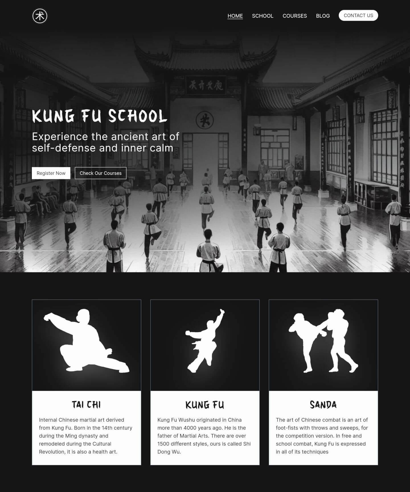

# Kung Fu School

[](https://astro.build/)
[](https://www.typescriptlang.org/)
[](https://tailwindcss.com/)

I am developing a website for a Kung Fu school located in La Rochelle, France. The current website is outdated and does not reflect current best practices in web design.

My work involves designing and developing a complete redesign of the website, with a new design, to provide a quality user experience with the best performance. Additionally, the idea is to create a software solution that integrates other services such as content management, registration, and learning tracking.

## ✨ Demo

👉 https://jeromeabel.github.io/kungfuschool/



## 🚨 Prerequisites

You will need:

- [NodeJS](https://nodejs.org/)
- [Git](https://git-scm.com/)
- A terminal to run commands

## 🛠️ Installation

```sh
git clone git@github.com:jeromeabel/kungfuschool.git
cd kungfuschool
npm install
```

## 🚀 Utilisation

```sh
npm run dev
```

Open the browser at the address: http://localhost:4321/kungfuschool

## 📝 Documentation

- Version 1 mockup on [Figma](https://www.figma.com/file/sW8NgzHukO70ZU6zs8l920/Kung-Fu-School?type=design&node-id=1-1843&mode=design)
- Analysis and design on the [Wiki](https://github.com/jeromeabel/kungfuschool/wiki)
- Task management and user stories on the [Kanban](https://github.com/users/jeromeabel/projects/5)

## Steps

- [ ] **V1 - Visitor Experience Enhancement**:
  - Responsive/consistency in design
  - Improvement of SEO and performance (Lighthouse score)
- [ ] **V2 - CMS for Admin**:
  - Administrator autonomy in managing news and content
- [ ] **V3 - Enhanced Registration Process**:
  - Simplification of registration management for the administrator
  - Improvement in communication with students (announcements, notifications)
- [ ] **V4 - Online Store**:
  - Facilitation of the payment process for students
  - Increase in association revenue
  - Diversification of products, showcasing an expanded view of Chinese martial arts culture
  - Student loyalty through exclusive products and promotions
  - Facilitation of student support through donations
- [ ] **V5 - Learning Platform**:
  - Improvement in the learning experience (tracking, content)
  - Implementation of a system to collect and display testimonials
  - Mobile app version for students
- [ ] **V6 - SaaS**:
  - Introduction of a software solution as a service (SaaS)
  - Addressing the administrative needs of any sports school

## 👤 Author

[@jeromeabel](https://github.com/jeromeabel)
